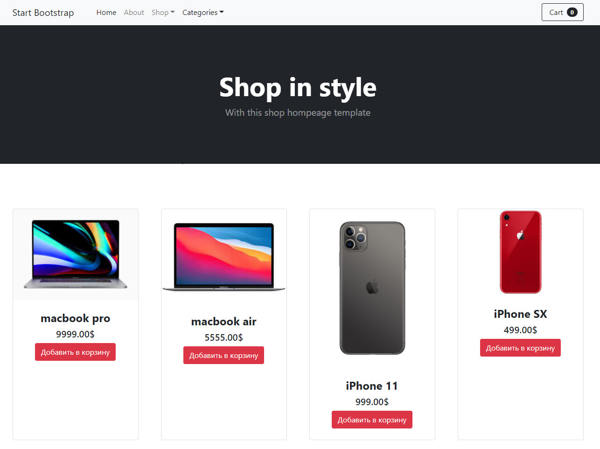
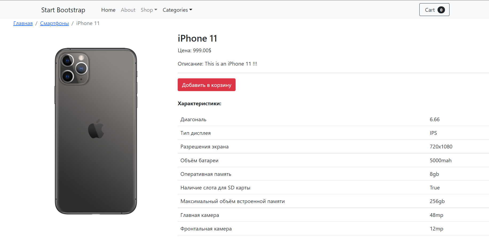
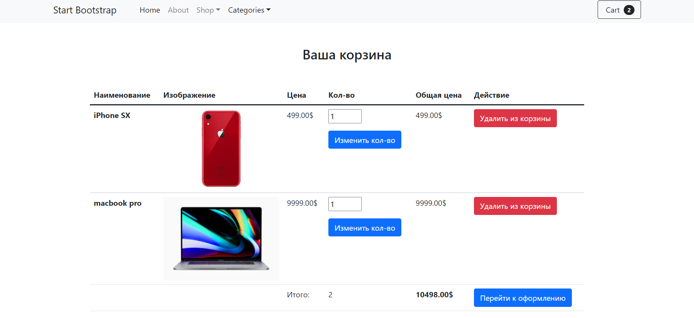

# E-commerce shop on Django3

## Installation

  > python -m venv venv
  >> venv\Scripts\activate.bat
  >>> pip install -r requirements.txt

## Start

 > python manage.py migrate
 >> python manage.py runserver

## Preview

